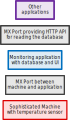

MX Port Demo with Node-RED
=======================

*Illustrating the concept of MX Ports with Node-RED*

This project is a self-contained demonstration system for the MX Port concept.
It is implemented with Node-RED and it serves two purposes:

1. The Node-RED flows in the project demonstrate the MX Port concept
   both functionally and visually.
   The MX Port components *Adapter*, *Converter* and *Gate* are considered here
   while the components *Access and Usage Control* as well as *Discovery*
   are not covered.

2. The project is a blueprint for IT/OT integration.
   Other heterogeneous sources can be integrated in the same way.
   The integration stack is implemented entirely in Node-RED.
   The stack begins with a Modbus device at the bottom
   and goes up to exposing an HTTP interface.
   
   On top of this, the integration stack can be extended by other applications.
   However, Node-RED is not needed for that because relevant softwares
   like AAS servers and connectors (EDC Connector and variants)
   can integrate HTTP APIs as data sources out of the box
   (only configuration required).

If you need help with running this project in Node-RED, read the section
[Getting started with Node-RED projects](#getting-started-with-node-red-projects).


Teaser: What to find inside the project
-----------------------------------

The project has the following flow structure:



The shown image depicts a vertical integration stack
from a machine at the bottom to some arbitrary application at the top.
Each box in the stack represents a system, wich is modeled within Node-RED
except for the upper box, which is only commented, but not implemented.
The stack includes two MX Ports shown as grey boxes.
For viewing the inner structure of each box, open the project in Node-RED.

The monitoring application in the middle of the stack has a dashboard
as user interface, which is shown in the screenshot below:


Using the HTTP API
---------------

The HTTP API exposed by the second MX Port (the upper one in the stack
shown above) has a single endpoint:

```http
GET /factoryx/{device}/{property}
```

This endpoint fetches measurements as time series data.

It has two *path parameters*:

* `device`: The device for which measurements shall be retrieved.
* `property`: The property of the device identifying the specific time series.

The implemented demonstration system only provides data for
`/factoryx/machine/temperature`.
Additionally, the path `/factoryx/otherMachine/someProperty` is valid,
but it provides no data (empty response).

The endpoint has two optional *query parameters*:

* `from`: A timestamp identifying the point in time
  from which the time series shall be returned.
  Any date-time string accepted by the
  [`Date.parse()`](https://developer.mozilla.org/en-US/docs/Web/JavaScript/Reference/Global_Objects/Date/parse)
  method of JavaScript can be used, e.&thinsp;g. `from=2025-07-01T00:00:00Z`.
* `to`: A timestamp identifying the point in time
  until which the time series shall be returned.

If none of these parameters is provided,
the recent hour of measurements is returned.
If only `from` is provided, one hour of measurements
starting with that point in time is returned.
If only `to` is provided, the measurements of the hour
before that point in time is returned.

The returned time series is encoded as JSON array.
Each entry in the array is a JSON object.
Each such object has a `timestamp` attribute and
additional attributes depending on the specific property requested.
For example, a request to `/factoryx/machine/temperature`
is replied with a response of the following kind: 

```json
[
    {"timestamp": "2025-07-01T16:26:30.000Z", "temperature": 54},
    …
]
```

In case of an error, the response status code is either 404 or 500,
and the response object provides a description of the error.


Getting started with Node-RED projects
----------------------------------

Basic knowledge of [Node-RED](https://nodered.org/)
and access to an installation of Node-RED is assumed.
However, running a Node-RED project available via Git
requires some additional configuration, which is explained below.

To work with Node-RED projects, the project feature must be enabled first
in your local, user-specific Node-RED configuration file
`~/.node-red/settings.js` by setting the entry
`$.'module.exports'.'editorTheme'.'projects'.'enabled'` to `true`.
Afterwards, creating, opening, and cloning projects can be done
from the Node-RED frontend main menu under “**Projects**”.
Note that Git version control is inherently integrated
into the project feature of Node-RED.

Dependencies of a project on additional Node-RED modules are managed
in the Node-RED frontend from within “**Project Settings**” menu
found under “**Projects**” in the main menu.
The dependencies configuration shown there corresponds
to the dependencies declared in the projects’ `package.json` file.

Declared dependencies must be installed locally.
For this, the dependencies configuration menu shows an installation button
if needed (i.&thinsp;e. if not locally installed so far).
Additionally, managing all locally installed modules is done
with the Palette Manger accessible under “**Manage palette**”
in the Node-RED frontend main menu.

See https://nodered.org/docs/user-guide/projects/
for more information on working with projects in Node-RED.


Project credentials
-----------------

This project is not intended to contain any secrets (passwords, keys),
and hence it does not contain any credentials in its `flows_cred.json` file.
Therefore, that file itself has not been encrypted.
Consequently, when importing this project, you don't provide a credentials key.
